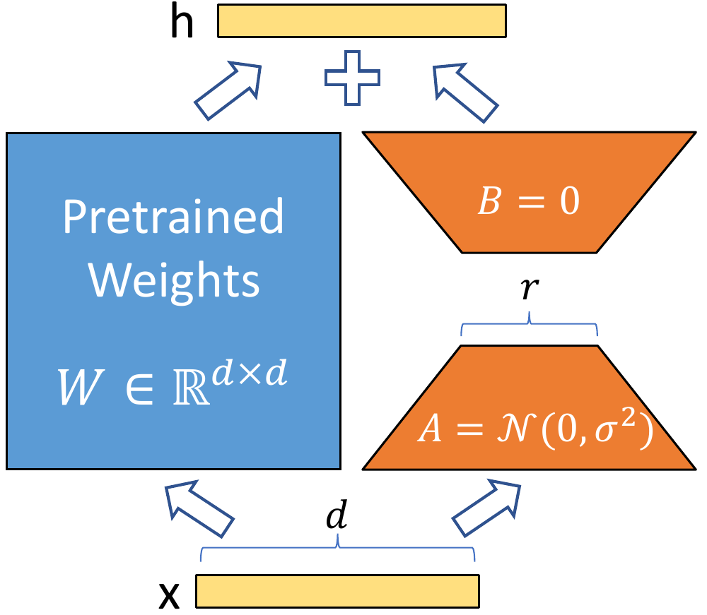
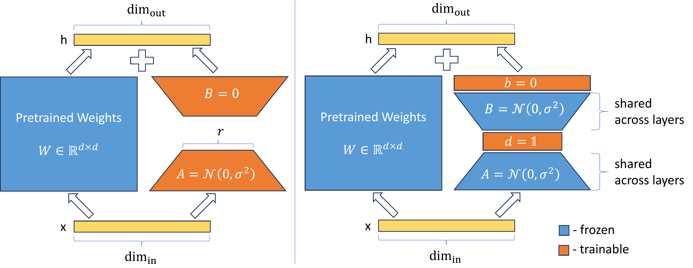
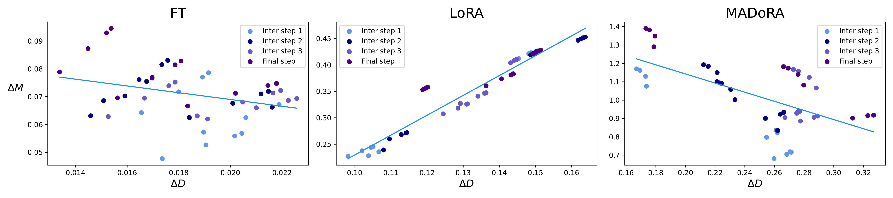
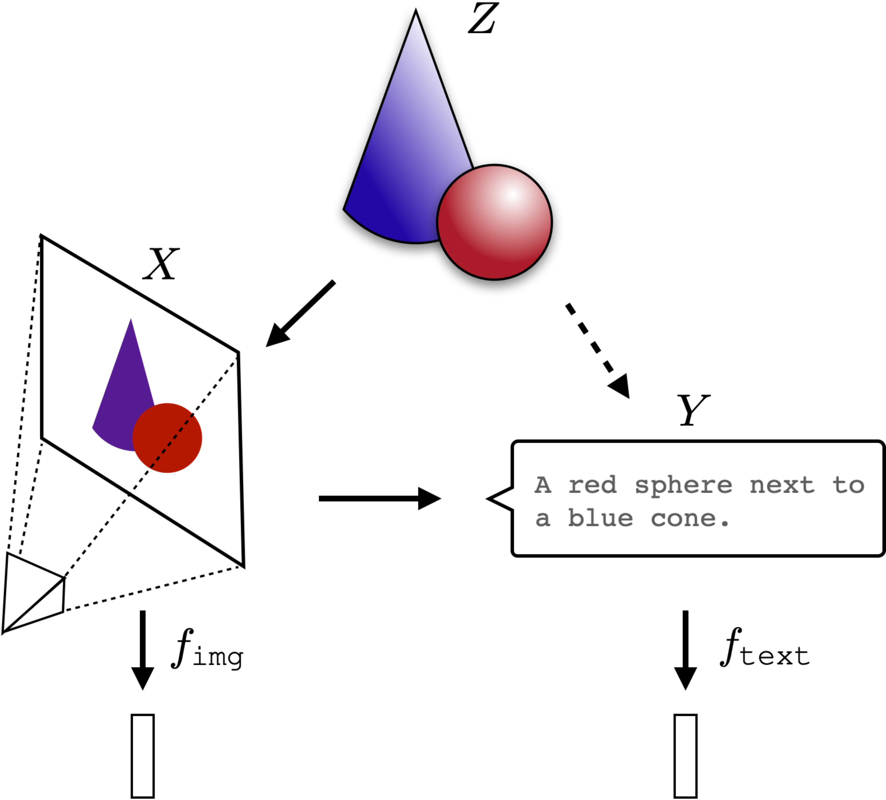

# VeRA: Vector-based Random Matrix Adaptation [[1]](#ref1)
- EECE695E_2024_Spring_Blog for Efficient Machine Learning Class w/ Sejin Park and Kyumin Cho

## Introduction to LoRA (Low Rank Adaptation) [[2]](#ref2) family of PEFT (Parameter Efficient Finetuning)
Large language Models or LLMs consists of at least billions of parameters. This makes it extremely expensive to run inference on the model or train and finetune it. For example, the weights of GPT-3 175B can take up to 350GB when stored in FP16 precision (2 bytes per FP16 x 175B=350GB) when used in inference. Training requires storing additional parameters such as the optimizer states and gradients in GPU VRAM in higher precision (FP32). Assuming FP32 training with AdamW optimizer, storing the model weights requires 4 bytes for each parameter in FP32, 8 bytes per parameter to for the optimizer AdamW (where two states, first moment and second moment in FP32, are maintained for each parameter), and 4 bytes per parameter to store the gradient in FP32. This adds up to 16 bytes of storage space needed for each model parameter required for training. [[3]](#ref3) This shows that each trainable parameter adds a lot of overhead due to different types of data like optimizer state and gradients that needs to be stored.

### Memory Usage Breakdown for Training (FP32 AdamW) [[3]](#ref3) 
| Component                     | Memory Requirement (bytes)                |
|-------------------------------|-------------------------------------------|
| **Model Weights**             |                                           |
| - fp32 training               | 4 bytes * number of parameters            |
| **Optimizer States**          |                                           |
| - AdamW                       | 8 bytes * number of parameters (2 states) |
| **Gradients**                 | 4 bytes * number of parameters            |
| **Forward Activations**       | Size depends on sequence length, hidden size, and batch size |
| **Temporary Buffers**         | Size varies based on specific operations  |
| **Functionality-specific memory** | Size varies based on additional functionalities |
| **Total (excluding variable sizes)** | 16 bytes * number of parameters   |

This means that a full finetune of a small model such as Llama-3 8B can take 128GB (16 bytes x 8B = 128GB) just to store the parameters. This calculation excludes the forward activations as well as the training batch data which mean often higher amount of VRAM capacity is often needed. This makes even training relatively small models impossible on a single GPU as datacenter-class GPUs such as A100 or H100 max out at 80GB and especially difficult for consumer level GPUs such as the RTX 4090 which only has 24GB.

Not only does the weights needs to be stored on the GPU VRAM during VRAM, each finetune version of the model needs to store the entire copy of the model. This means even if mass-storage devices like HDDs are used, it becomes prohibitively impossible to store multiple custom finetune version of the data itself.

Therefore parameter efficient finetuning or PEFT methods have been developed that is able to finetune and specialize LLMs by only using small amount of parameters, this not only reduces the number of GPUs required to train the model itself, it cuts down on the permanent storage capacity required to store multiple versions of it. The most popular of these approaches is low rank adaptation or LoRA. As its name suggests, this technique uses low-rank matricess to represent large matrices in LLMs. The hidden dimension size in LLMs gets very large with size with GPT-3 175B having a hidden dimension (d) of 12,288. By multiplying two matrices with extremely low rank (as low as 1 or 2), it is possible to represent a large matrix. By encoding changes to the original weight in this large matrix new versions of the model can be stored with a very small memory footprint. In the case of GPT-3 175B, the authors of the paper reported reduction as large as 10,000x (from 350GB to 35MB), with rank size of 4 and when being only applied W_Q and W_V projection matrices. This low rank reduction of changes is based on the assumption that the change in weights during finetuning has a low intrinsic rank, based on previous studies [[7]](#ref7) [[8]](#ref8) that claim that learned over-parameterized models reside in the low intrinsic dimension. 

Since only the differences to the original model are tracked in training, original model parameters can be frozen and only the small low-rank matricess need to be trained. Gradients or optimizer states don't are not required for the original model, only for the small low-rank matricess, so this greatly reduces the GPU VRAM requirement. Also, when servicing large variations of custom finetune models, only a single copy of the large model needs to be stored and each version only needs to store the small low-rank matricess that represents the difference between the original weights. This makes servicing large number of variations feasible and makes switching model versions easy as only the small LoRA weights need to be loaded and merged without loading the entire model itself.

Let the pre-trained weight matrix be W_o \in \mathbb{R}^{d \times k}.

The modified weight matrix is given by:

W_o + \Delta W = W_o + BA
where B \in \mathbb{R}^{d \times r}, A \in \mathbb{R}^{r \times k}, \text{rank } r \ll \min(d, k)\, and \\Delta W = BA.

The original forward pass is:

h = W_o x

The modified forward pass is:

h = W_o x + \Delta W x = W_o x + B A x

This can be shown in the following diagram.

In LoRA, W_o matrix usually corresponds to W_Q, W_K, W_V, or W_O, query, key, value, and output projection matrices of attention as opposed to Feed Forward Networks (FFN) matrices as hidden size of FFNs tend to be much larger then projection matrices of attentions. The most common practice seems to be injecting LoRA into query and value though exact implementation can vary widely.

During training B can be initialized as 0 so that \Delta W = B A is also 0 when training starts.

When LoRA weights are deployed the original weights and the LoRA weights can be merged, W = W_o + B A , before inference proceeds as usual. The original weights can be obtained by subtracting the LoRA weights (B A).

Unlike other PEFT methods such as adapter layer insertion, LoRA adds no additional latency after the weights are merged as the forward inference operation is exactly the same and no additional operation needs to be performed. This contributed to the popularity of LoRA as no changes to the inference code needs to be made and only weight merging operations before inference are needed which is relatively quick and easy to perform.

## How VeRA works
Even with parameter efficient nature of LoRA it still requires a non-trivial amount of storage for each version. If a custom version was wanted for each vendor or consumer the storage requirement can easily add up. Even for a PEFT technique like LoRA, a finetune version of GPT-3 175B with a low rank of 4 applied to only query and value projections needed several dozen megabytes in storage. If a custom version was to be stored for each users, a million users would amount to dozens of terabytes of storage. This limits the scalability of LoRA for personalization and demands an even more parameter efficient PEFT technique than LoRA which is where VeRA comes in. 

VeRA tries to take advanatage of random matrices and projection to reduce the number of unique parameters needed for each finetune. The idea is to take a pair of randomly initialized matrices and attach a pair of scaling vectors that reparameterize it. The randomly initialized matrices remain frozen while the scaling vectors are trainable. If we use the same seed when generating the random matrices through a PRNG (pseudorandom number generator). We do not need to store the random matrices and only need to store the smaller scaling vectors. This greatly reduces the storage requirement of VeRA and allows larger ranks without drastically increasing the storage requirement.

This table taken from [[1]](#ref1) shows the relative storage efficiency of VeRA compared to LoRA, when only applied to the query and key projection layers.
| Model | Rank | LoRA - # Trainable Parameters | LoRA - Required Bytes | VeRA - # Trainable Parameters | VeRA - Required Bytes |
|-------|------|-------------------------------|----------------------|-------------------------------|-----------------------|
| \{RoBERTa}_{\text{base}}  | 1    | 36.8K                         | 144KB                | 18.4K                         | 72KB                  |
| \{RoBERTa}_{\text{base}}  | 16   | 589.8K                        | 2MB                  | 18.8K                         | 74KB                  |
| \{RoBERTa}_{\text{base}}  | 256  | 9437.1K                       | 36MB                 | 24.5K                         | 96KB                  |
| \{RoBERTa}_{\text{large}} | 1    | 98.3K                         | 384KB                | 49.2K                         | 192KB                 |
| \{RoBERTa}_{\text{large}} | 16   | 1572.8K                       | 6MB                  | 49.5K                         | 195KB                 |
| \{RoBERTa}_{\text{large}} | 256  | 25165.8K                      | 96MB                 | 61.4K                         | 240KB                 |
| GPT-3 | 1    | 4.7M                          | 18MB                 | 2.4M                          | 9.1MB                 |
| GPT-3 | 16   | 75.5M                         | 288MB                | 2.8M                          | 10.5MB                |
| GPT-3 | 256  | 1207.9M                       | 4.6GB                | 8.7M                          | 33MB                  |

Let the pre-trained weight matrix be W_o \in \mathbb{R}^{d \times k}.

(The parameters updated during training are underlined.)

The original LoRA formulation is the following:

W_o + \Delta W = W_o + \underline{B A}
where B \in \mathbb{R}^{d \times r}, A \in \mathbb{R}^{r \times k}, \text{rank } r \ll \min(d, k)\, and \\Delta W = BA.

The original forward pass is:

h = W_o x

The LoRA forward pass is:

h = W_o x + \Delta W x = W_o x + \underline{B A} x

In the case of LoRA low-rank matrices A and B are updated.

For VeRA the following formulation can be used:

W_o + \Delta W = W_o + BA = W_o + \underline{\Lambda_b} B \underline{\Lambda_d} A 

The VeRA forward pass being:

h = W_o x + \Delta W x = W_o + \underline{\Lambda_b} B \underline{\Lambda_d} A x

In the case of VeRA B and A matrices are frozen and randomly initialized. Scaling vectors b \in \mathbb{R}^{1 \times d} and d \in \mathbb{R}^{1 \times r} are trainable, and is denoted as diagonal matrices \Lambda_d \in \mathbb{R}^{d \times d} and \Lambda_d \in \mathbb{R}^{r \times r} in the equations.

Unlike in LoRA, the B and A matrices do not need to be low-rank as their values does not need to be stored, they can always be reproduced with a fixed random seed. Only the small b and d vectors need to be updated.
During training vector b is set as 0 to keep \Delta W as 0 while vector d is initialized using Kaiming initialization.

More precisely the number of trainable parameters with VeRA scales as L_\text{tuned} \times (d_\text{model} + r), whereas LoRA scales as 2 \times L_\text{tuned} \times d_\text{model} \times r. 

(L_\text{tuned} denote the number of finetuned layers and d_\text{model} represents the dimension of the layers.)

This means that LoRA memory size dramatically with the increase of rank, VeRA can increase the rank without incurring much memory footprint.

This can be shown in the following figure comparing LoRA and VeRA.

## Performance 
The original VeRA paper [[1]](#ref1) found that VeRA tended to perform relatively competitively on various models such as RoBERTa, GPT-2, or on different modalities such as vision while using substantially less trainable parameters.

### RoBERTa Base GLUE benchmarks
| Method | # Trainable Parameters | SST-2 | MRPC | CoLA | QNLI | RTE | STS-B | Avg. |
|--------|------------------------|-------|------|------|------|-----|-------|------|
| Full Finetune     | 125M                   | 94.8  | **90.2** | 63.6 | 92.8 | 78.7| 91.2  | 85.2 |
| LoRA   | 0.3M                   | **95.1**±0.2 | 89.7±0.7 | 63.4±1.2 | **93.3**±0.3 | **86.6**±0.7 | **91.5**±0.2 | **86.6** |
| VeRA   | **0.043M**                 | 94.6±0.1 | 89.5±0.5 | **65.6**±0.8 | 91.8±0.2 | 78.7±0.7 | 90.7±0.2 | 85.2 |

### GPT-2 Medium E2E benchmarks
| Method    | # Trainable Parameters | BLEU  | NIST | METEOR | ROUGE-L | CIDEr |
|-----------|------------------------|-------|------|--------|---------|-------|
| FT        | 354.92M                | 68.2  | 8.62 | 46.2   | 71.0    | 2.47  |
| LoRA      | 0.35M                  | 68.9  | 8.69 | 46.4   | 71.3    | **2.51**  |
| VeRA      | **0.098M**                 | **70.1**  | **8.81** | **46.6**   | **71.5**    | 2.50  |

### Image classification benchmarks
| Method       | # Trainable Parameters | CIFAR100 | Food101 | Flowers102 | RESISC45 |
|--------------|------------------------|----------|---------|------------|----------|
| **ViT-B**    |                        |          |         |            |          |
| Head         | -                      | 77.7     | 86.1    | 98.4       | 67.2     |
| Full         | 85.8M                  | **86.5**     | **90.8**    | 98.9       | **78.9**     |
| LoRA         | 294.9K                 | 85.9     | 89.9    | 98.8       | 77.7     |
| **VeRA**     | **24.6K**              | 84.8 | 89.0  | **99.0**   | 77.0 |
|||||||
| **ViT-L**    |                        |          |         |            |          |
| Head         | -                      | 79.4     | 76.5    | 98.9       | 67.8     |
| Full         | 303.3M                 | 86.8     | 78.7    | 98.8       | **79.0**     |
| LoRA         | 786.4K                 | 87.0     | **79.5**    | 99.1       | 78.3     |
| **VeRA**     | **61.4K**              | **87.5** | 79.2 | **99.2**   | 78.6 |

## Extensions

### DVoRA (DoRA + VeRA)

DoRA (Weight-Decomposed Low-Rank Adaptation) [[4]](#ref4) is a modification on LoRA where the original weight is decomposed to magnitude and direction components to be finetuned with LoRA being used to finetune the direction component. The paper observes that when the weight matrix is decomposed to two separate components, magnitude and direction, LoRA tends to exhibit a proportional relationship between between changes of direction and magnitude whereas full finetuning tends to be more varied with a slight negative relationship. [[4]](#ref4) suggests that this show's LoRA's inability to decouple the changes in the magnitude and the direction. 

This relationship is shown in the following diagram. 

DoRA by training the magnitude and direction separately attempts to rectify this deficiency of LoRA. With this modification, [[4]](#ref4) claims that learning capacity and training stability is improved.

As DoRA uses LoRA as-is in its directional component training, [[4]](#ref4) also suggests a new method of PEFT by replacing LoRA with VeRA, named DVoRA. DVoRA merges the advantage of VeRA and DoRA and performs on par or even better than LoRA with fewer trainable parameters.

#### Average MT-Bench scores graded by GPT-4
| Model      | PEFT Method   | # Params (%) | Score |
|------------|---------------|--------------|-------|
| **LLaMA-7B**   | LoRA          | 2.31         | 5.1   |
|            | DoRA    | 2.33         | **5.5**   |
|            | VeRA          | **0.02**         | 4.3   |
|            | DVoRA   | 0.04         | **5.0**   |
| **LLaMA2-7B**  | LoRA          | 2.31         | 5.7   |
|            | DoRA   | 2.33         | **6.0**   |
|            | VeRA          | **0.02**         | 5.5   |
|            | DVoRA   | 0.04         | **6.0**   |

DoRA paper [[4]](#ref4) is an example of a paper that takes advantage the parameter efficiency of VeRA while incorporating its own improvements to create a more performant PEFT algorithm. 

## Future Avenue of Research

### Behavior of VeRA compared to LoRA
In the paper *LoRA Learns Less and Forgets Less* [[5]](#ref5) the authors claim that LoRA underpeforms full finetuning but, tends to retain the base model performance better on tasks outside of the finetune training data. The authors posits that this is due to the fact that full finetuning tends to fine higher rank weight perturbations compared to LoRA. Considering that VeRA has even fewer tunable parameters and rank of VeRA can be increased more freely compared to LoRA it seems that it would be worthwhile to explore the behavior of VeRA compared to LoRA. The original VeRA paper either used relatively older encoder-based models such as RoBERTa, relatively ocarse evaluations such as GLUE or ROGUE, or relatively simple instruction tuning dataset (Alpaca Cleaned). This paper focuses much more on relevant and challenging LLM tasks such as 

Few of things that can be compared is: 
- How performance of VeRA fares compared to LoRA and full finetuning on target domain task performance.
- Does VeRA exhibit the same regularization characteristic as LoRA by forgetting less of the source domain?
- Does sample-efficiency suffers compared to LoRA and full finetuning?

### NAS (Neural Architecture Search) to VeRA
LoRA's hyperparamters are rank size, which projection (key, query, value, output) to apply to, and which layer to apply it. But, LoRA's hyperparameters are more strictly bounded by practical constraints as memory overhead grows quickly with rank size. On the other hand, VeRA is less bounded by rank size which makes it more free to explore higher ranks and various configurations.

This relatively wider search space makes VeRA attractive for NAS compared to LoRA. A systemetic approach towards determining which layer to target, which rank to use, and which initial value to use for each application and modality could be an interesting research topic.

This research could also give us a glimpse into how each type of model responds to PEFT tuning. Whereas the original LoRA dealt in relatively limited domains such as encoder-type LLMs, instruction tuning, or image classification. Today, LoRA family of PEFT has been expanded to continued pretraining of LLMs, finetuning diffusion models, customization of LLMs, et cetera. The relative low-overhead and wider search space of VeRA could be useful as a tool for exploring the optimal configuration of LoRA-type PEFT and how each domains works differently.

### Better initialization settings
The initalization scheme used in VeRA is relatively simple. The original VeRA paper does present some exploration and ablation studies of initialization schemes. The authors claim that using both d and b scaling vectors improve performance, using Kaiming uniform initialization for the performance is better, and initializing d vector with d_init set to 10^{-1} or 10^{-7} tends to outperform 1.0. 

But, the types of initializations and number of parameters explored are  limited and focus on relatively old model (RoBERTa) and coarse GLUE-based benchmarks such as RTE, MRPC, CoLA, and STS-B tasks. Additional experiments on more relevant LLM tasks such as instruction finetuning or continued pretraining could be more insightful as well as more diverse modalities(vision, sound, et cetera). For example, LoRAs have become a popular in diffusion models such as Stable Diffusion [[9]](#ref9) as a way of generating custom images. It would be meaningful to explore the behavior and the best settings for VeRA in these type of applications and tasks. 

Also, the fact that the rank can be scaled freely in VeRA with not much overhead was underexplored in the original paper. By varying and expanding the rank size to be much greater than what is feasible with LoRA it seems possible that VeRA could have higher rank compared to LoRA possibly leading to different behaviors. Varying the rank and the initializations of VeRA and comparing the SVD decomposition of VeRA, LoRA, and full finetuning seems like an underexplored topic. How different configurations of VeRA can change the behavior of the weight perturbations or how it relates to performance could be important for exploring how the weight features changes with finetuning. For example, [[5]](#ref5) claims that on full finetuning on code and math the model does not learn low-rank perturbations unlike the original assumptions behind LoRA. Considering that VeRA is able to expand to much higher rank, SVD analysis of VeRA when trained on complex tasks like code and math could yield interesting results.

### Universal basis matrices for VeRA

The Platonic Representation Hypothesis [[6]](#ref6) claims that representations in AI models are converging across multiple domains. The hypothesis claims that representation learning algorithms attempts to find vector embeddings that statistically model reality through various measurements and projections. The vector embeddings are all derived from reality and becomes more aligned as models become trained on more data and for more tasks. In the paper, authors claim that model alighment increases with performance and even models trained with different modalities (language and vision) tends to converge as performance increases.

If large fundamental models share a common representation, it is possible that there could be an ideal way to represent the randomized matrix basis on which VeRA operates well in. Currently the random A and B matrices are generated relatively arbitrarily. This could suggest a sort of "universal" matrices where VeRA would perform well for all models and domains as models converge on a similar representation. Even if this hypothesis is true in a limited sense this suggests that there could be a family of matrices that can represent the basis(A and B) for VeRA better. 

Research could attempt to isolate such basis matrices through statistical analysis of various SoTA (state of the art) models and compare against random Gaussian generated matrices. Initially the study could focus on models across a single modality such as vision and expand search for multi-modal models. This could not only lead to a more practical method of generating better performing basis matrices but also validate the Platonic representation hypothesis.

One stumbling block of applying VeRA to this hypothesis is that the hypothesis largely discusses representation while VeRA is about modifying the model weights. However, LoReFT (low-rank linear subspace ReFT) [[10]](#ref10) defines a methodology of finetuning a model by modifying its representations/activations, denoted as h. Using the formula:

\text{LoREFT}(h) = h + R^{T} (W h + b - R h), where R \in \mathbb{R}^{r \times d} and W \in \mathbb{R}^{r \times d} are low rank matrices.

Considering that LoReFT also uses a low-rank matrix to represent trainable changes, VeRA's methodology of using a randomly generated matrices with small vectors seems applicable. This expands the possibility that the hypothesis could be applicable for a LoREFT + VeRA hybrid as well.

## References
[1]: D. J. Kopiczko, T. Blankevoort, and Y. M. Asano, “VERA: Vector-based Random Matrix Adaptation,” arXiv.org, Oct. 17, 2023. https://arxiv.org/abs/2310.11454

[2]: E. J. Hu et al., “LORA: Low-Rank adaptation of Large Language Models,” arXiv.org, Jun. 17, 2021. https://arxiv.org/abs/2106.09685

[3]: “Efficient training on a single GPU.” https://huggingface.co/docs/transformers/v4.20.1/en/perf_train_gpu_one#anatomy-of-models-memory

[4]: S.-Y. Liu et al., “DORA: Weight-Decomposed Low-Rank Adaptation,” arXiv.org, Feb. 14, 2024. https://arxiv.org/abs/2402.09353

[5]: D. Biderman et al., “LORA learns less and forgets less,” arXiv.org, May 15, 2024. https://arxiv.org/abs/2405.09673

[6]: M. Huh, B. Cheung, T. Wang, and P. Isola, “The platonic representation hypothesis,” arXiv.org, May 13, 2024. https://arxiv.org/abs/2405.07987

[7]: C. Li, H. Farkhoor, R. Liu, and J. Yosinski, “Measuring the intrinsic dimension of objective landscapes,” arXiv.org, Apr. 24, 2018. https://arxiv.org/abs/1804.08838

[8]: A. Aghajanyan, L. Zettlemoyer, and S. Gupta, “Intrinsic dimensionality explains the effectiveness of language model Fine-Tuning,” arXiv.org, Dec. 22, 2020. https://arxiv.org/abs/2012.13255

[9]: R. Rombach, A. Blattmann, D. Lorenz, P. Esser, and B. Ommer, “High-Resolution Image Synthesis with Latent Diffusion Models,” arXiv.org, Dec. 20, 2021. https://arxiv.org/abs/2112.10752

<!-- Original source repository can be found here: https://github.com/kmcho2019/EECE695E_2024_Spring_Blog -->

[10]: Z. Wu et al., “REFT: Representation Finetuning for Language Models,” arXiv (Cornell University), Apr. 2024, doi: 10.48550/arxiv.2404.03592.

